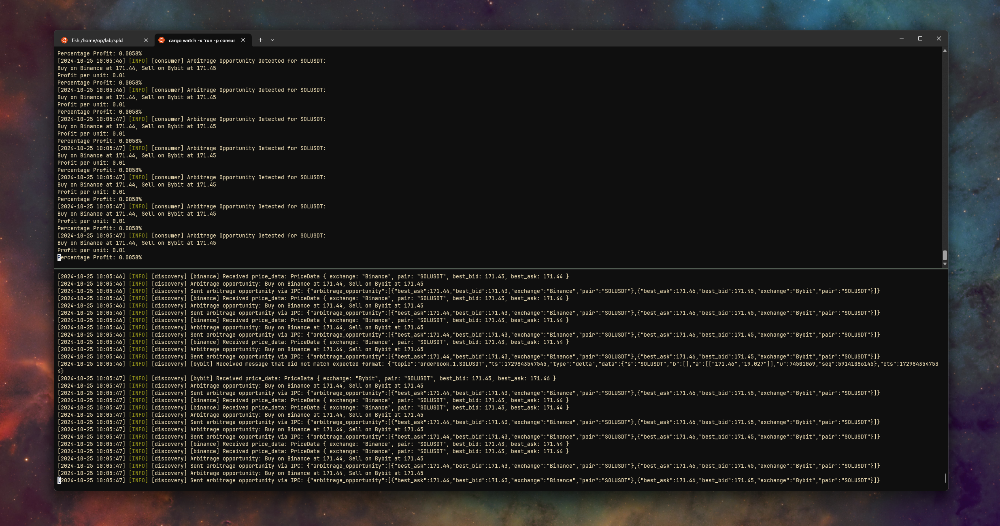

## Arbitratus

> Aragorn kommer.



`discovery` package "discovers" prices and detects arbitrage opportunities.
If found it sends current price data to a normal unix IPC socket.
`consumer` listens to the IPC socket and consumes messages.


#### Dev
---

Install [CARGO-WATCH] if not installed, enables `cargo watch` command.

**run `consumer`**
```
cargo watch -x 'run -p consumer'
```

**run `discovery`**
```
cargo watch -x 'run -p discovery'
```


[CARGO-WATCH](https://github.com/watchexec/cargo-watch)


